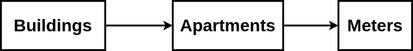

# DASHBOARD DEVELOPMENT GUIDE:

## INTRODUCTION:
Thingsboard provides a powerful dashboarding feature that allows users to create intuitive and customizable dashboards to visualize data from their IoT devices. Dashboards are composed of widgets, which are individual components that display data in various formats such as charts, maps, and tables. 

In this section, we will provide an example of how to create a dashboard in Thingsboard to help you better understand how to use this feature.
## EXAMPLE SCENARIO:

Let's say you are the building manager for a high-rise apartment complex, and you want to monitor the energy consumption of each apartment in the building. You want to create a dashboard that allows you to monitor the energy consumption of each electric meter in each apartment, and provides you with alerts if the energy consumption exceeds a certain threshold.

Let's understand the basic components that we needed to build the dashboard.
1. ASSET: An asset is a virtual representation of a physical entity, such as a machine, building, or vehicle. An asset can have attributes and may be associated with one or more devices.
2. DEVICE: A device is a physical or virtual device that is capable of collecting and transmitting data. Devices are connected to the Thingsboard platform and can be used to monitor and control physical assets.
3. RELATION: A relation is a connection between two entities, such as an asset and a device. Relations can be used to model and visualize the relationship between entities in the system. For example, you can create a relation between an asset and a device to represent the fact that the device is installed on the asset and collecting data about it. You can also create a relation between two assets to represent a hierarchical or spatial relationship, such as a building and its floors, apartments, rooms etc.
4. ATTRIBUTE: An attribute is a key-value pair associated with an entity. Attributes can be used to store additional information about the entity, such as its location, status, or metadata. Attributes can be updated over time as the state of the entity or asset changes. You can learn more about Attributes from [here](https://thingsboard.io/docs/user-guide/attributes/#attribute-types). 

**Here is the diagram for our example scenario:**
___ 



Let's assume that there can be multiple buildings and apartments and meters. According to the example scenario we actually don't need apartments since each apartment will have a single meter. But for this example we will keep it as it will be helpful in future to build complex dashboard. We will represent buildings and apartments by Assets and meters by Devices.

Lets create some assets which will represents buildings and apartments.

Now, lets create 2 Asset profile for buildings and apartments and a device profile for meters. For buildings and apartments Asset profile name will be building and apartment respectively and for meters device profile name will be meter. 


Now create some assets to represent buildings and apartments.

For now create a Building ```Building A``` and 3 Apartments ```Apartment A```, ```Apartment B``` and ```Apartment C```. For Buildings select Asset profile ```building``` and for Apartments select asset profile ```apartment```.


And create 3 Devices ```Meter 1```, ```Meter 2``` and ```Meter 3``` to represent Meters. 


Now we will create relation between buildings and apartments. To do that, navigate to ```Asset groups -> All``` and click on ```Building A``` and goto Relations tab.


Select ```From``` from Direction dropdown and click on ```Add(+)``` button.


Thingsboard provides 2 Relation type by default ```manages``` and ```contains```. But we can create our own Relation type if we want. For now select ```contains``` Relation type. Select ```Asset``` from ```Type``` dropdown and select ```Apartment A```, ```Apartment B``` and ```Apartment C``` and click on ```Add``` button. 


Since building has an address that identifies its location, we will add a ```SERVER ATTRIBUTE``` for ```Building A```. To add an Attribute goto Attributes tab and click on ```Add(+)``` button. 

Enter a name for key field. Select String from Value type and give it a value. click on ```Add``` button to add the attribute. 


Similarly we will create relation between Apartments and Meters. We will create relation between ```Apartment A and Meter 1```, ```Apartment B and Meter 2``` and ```Apartment C and Meter 3```.

Click on ```Apartment A``` and goto ```Relation``` tab and create a ```From``` Relation. 


Do it for ```Apartment B``` and ```Apartment C``` as well. 

Let's create a dashboard to visualize our example scenario:

To create a dashboard, first navigate to the Dashboards tab on the left-hand menu. Click on the Create Dashboard (+) button in the top right corner and give your dashboard a name and description (optional) and Click on Add button.


Navigate to newly created dashboard and click on edit button on the right button corner. You will see something like this. 


When you create a new dashboard in Thingsboard, you will have several options to customize and configure the dashboard.

1. **Manage dashboard states:** You can manage dashboard states from here. When you create a dashboard, thingsboard creates a default state for us. If you want to create more states, you can create from here. For our example scenario, we will need multiple states. So we will learn more about it later. 
2. **Manage layouts:** You can select a layout template for your dashboard, which determines the arrangement of widgets and their sizes. 
3. **Settings:** provides several options, including State Controller, Title Settings, Dashboard Logo etc. These options allow us to customize the appearance and behavior of the dashboard.
4. **Entity aliases:** You can create entity aliases from here. Alias is a reference to a single entity or group of entities that are used in the widgets. Alias may be static or dynamic. You can read this article to learn more about [aliases](https://thingsboard.io/docs/user-guide/ui/aliases/).
5. **Filters:** Filters allows you to select specific data based on certain criteria. This can be useful when you want to display only a subset of the available data on a widget. It is like if-else conditions in programming.
6. **Edit timewindow:** You can select a time range to display data from a specific time period.
7. **Export dashboard:** This option allows you to export the current dashboard configuration as a JSON file. This can be useful when you want to save a backup of your dashboard configuration, or when you want to share the dashboard with others.
8. **Version control:** This option allows us to manage and track changes made to the dashboard configuration over time. You can read more about version control from [here](https://thingsboard.io/docs/user-guide/version-control/). 
9. **Add new widget:** You can choose the type of widget you want to add. You can then customize the widget settings such as data source, visualization type, and layout.
 
10. **Add and save controls:** You can add new widgets, apply changes, or decline changes. Click ```Add Widget(+)``` to add a new widget, customize the settings, then click ```Apply Changes(✓)``` to save changes. Click ```Decline Changes(✖)``` to discard unsaved changes and revert to the previous dashboard configuration.

Now, lets add an entity table widget to display all buildings. For that click on ```Edit button(✎)``` from the bottom right corner and click on ```Add new widget(+) button```. 


Click on ```Cards``` and select ```Entities table``` widget. 


After selecting the widget you will see something like this:


The configuration options available for each widget will vary depending on the type of widget you have selected. But for the most widgets you will see these options:
1. Data: This option allows you to configure the data source for the widget. You can choose the entity or list of entities that the widget should display data for, as well as the data keys that should be displayed.

2. Settings: This option allows you to configure the appearance and behavior of the widget. Depending on the widget type, you might be able to adjust things like the colors used, the size of the widget, and the behavior of the widget when the user interacts with it.

3. Advanced: This option provides access to more advanced configuration options for the widget. Depending on the widget type, you might be able to adjust things like the precision of the data displayed, or the format of the labels used.

4. Actions: This option allows you to perform actions on the widget. For an example, you can create action which will allow you to add, remove, delete entities in the widget. 

Now, lets select a datasource. In this table we will display all buildings name. In order to show all buildings name in the Entities table widget we need to create an ```Entity alias``` first. To create it, first click on ```Add``` button from ```Data``` section and then click on Entity alias input box and click on ```Create a new one```. 


Give it a name as you wish and select ```Asset type``` from ```Filter type``` and select ```building``` from ```Asset type``` and ```Add```. This alias will get all Assets with Asset type ```building```. 


Finally, click on ```Add``` button from Add Widget modal.


Resize it as you want and Save it(✓).


Lets give it a name and customize the entity table column titles. To do that, click on ```enter edit mode(✓)``` button from bottom right corner and click on ```Edit widget(✎)``` button.

Goto ```Advanced``` Tab and type your desired name on ```Entities table title``` input box and untoggle marked toggle buttons. 


Now goto ```Data``` Tab again and type and select ```name```, ```address``` from latest data keys Autocomplete. Save and close it. After closing the Edit widget modal Click on apply changes button. 


Now we will create 2 states for ```Apartments``` and and ```Meters```. Click on ```Enter edit mode()``` button and click on ```Manage dashboard states``` button.


Add 2 dashboard states and Save it. 


Now, we want our users to be able to navigate to building state to apartment state and apartment state to meter state. For that we will create an action which will allow users to navigate to building page to apartment page. 

Goto Actions Tab from the Entities table edit mode and click on Add action(+) button. 


Now we can use arrow button to navigate to Apartments page. 

There is another way that we can use to navigate between states, that is using custom action. From ```Type``` we can select custom action and use the function below to navigate to a specific state. 

```js
openDashboardState('apartments_page'); //pass the state id

function openDashboardState(stateId) {
    var currentState = widgetContext.stateController
        .getStateId();
    if (currentState !== stateId) {
        var params = {};
        // widgetContext.stateController.updateState(stateId, params, false); // same as update current dashboard state
        widgetContext.stateController.openState(stateId, params, false); // same as navigate to new dashboard state
    }
}

function resetDashboardState() {
    widgetContext.stateController.resetState();
}
```

This is helpful in some scenario, specially when build a custom widget and you want to navigate to a dashboard state. 

Now, lets navigate to Apartments page. We will again add Entities table widget to display all apartments. Also we will create some actions which will allow users to navigate to Meters page and create, edit and delete apartment.

After navigating, Enter edit mode and select Entities table widget. From Data section Add a datasource and type ```apartments related to building``` on Entity alias input field and click on ```Create a new one```. 


Input it as shown in the screenshot below and click on ```Add``` button.


Select ```Contains``` from Type and Select ```Asset``` from Entity types and click on ```Add``` button.


Type and select name field in Latest data key autocomplete and do what we have done for Buildings List such as Change the table name and Add navigation button. After that add the table.


Now, we will add 3 additional buttons to add, edit and delete apartments. 

Goto widget Actions Tab and create 3 buttons as shown in the screenshots below.

For add we will add a widget header button.


For edit and delete we will create 2 Action cell buttons. 


Lets configure the custom action for Add apartment.

Thingsboard provides 3 examples for Add, Edit and Delete entities that we can use. 

# WIDGET DEVELOPMENT GUIDE:
## INTRODUCTION: 
Sometimes default widgets provided by thingsboard doesn't meet the business requirement. For that we need to develop custom widgets.

In this tutorial, we will build a custom widget on low code platform to understand the basics of widget development. 

Here are the topics you must know before jumping into widget development:
1. Basics of ```DEVICE``` and ```ASSET```.
2. Basic understanding of ```CONVERTER``` and ```INTEGRATION```.
3. You know how to send telemetry or attributes to a ```DEVICE``` or ```ASSET```.

## BASICS:
Goto our custom middleware or thingsboard.cloud / demo.thingsboard.io and log into your account. Goto ```Widgets Library``` and Click on the **```+```** Button and create a new widget bundle. 


Create a new widget under the widget bundle you've just created.

**You can create 5 Types of widgets:**

1. Time series - Time series widgets display data over time, such as historical data or real-time data from sensors. These widgets can display data in various formats, including line charts, bar charts, and gauges.

2. Latest value - Latest value widgets display the most recent data from a data source. These widgets are often used to display the current state of a device or system.

3. Control widget - Control widgets(RPC (Remote Procedure Call) widgets) allow users to control devices or systems by sending commands through the widget. These widgets are often used for remote device management or control.

4. Alarm widget - Alarm widgets display alarms and events generated by ThingsBoard. These widgets can be used to monitor and manage alarms and events in real-time.

5. Static widget - Static widgets display static content, such as text, images, or videos. These widgets can be used to provide context or additional information to users.

For this example we will create a static widget. For that you can select static widget from Widget types. after that you will see something like this. 


**Here is the overview of the things you see here:**
1. ```Widget title:``` you can set a widget title here.
2. ```Widget type selection dropdown:``` You can change widget type from here if you want to change it later.
3. ```Resources:``` This is where you will add all the CDN's required for this widget.
4. ```HTML/CSS:``` In this section you can define the layout and styling of your custom widget. This section allows you to write HTML, CSS, and JavaScript code to create a custom user interface for your widget. Also you will be able to use Angular features just like our custom middleware codebase. 
5. ```Controls:``` In widget development, there are several options available for saving, undoing, and running your changes. These options are typically available in the toolbar or menu bar of the widget editor.

    1. ```Save``` - This option allows you to save your changes to the widget. You can use this option to save your changes periodically or after making significant changes to the widget.

    2. ```Save As``` - This option allows you to save a copy of the widget with a different name or in a different location. This is useful if you want to create a new version of the widget without overwriting the existing version.

   3. ```Run``` - This option allows you to test the widget and view it in the context of a dashboard. When you click the "Run" button, ThingsBoard will generate a preview of the widget in a separate window or tab, allowing you to see how it will appear on a dashboard.

   4. ```Undo``` - This option allows you to undo the last change you made to the widget. This can be useful if you make a mistake or want to revert back to a previous version of the widget.
6. ```Settings schema:``` Settings schema is a JSON object that defines the structure and validation rules for a widget's settings. The settings schema is used to create the settings UI for the widget in the dashboard.
7. ```Data key settings schema:``` DataKey settings schema is a property that defines the data source for a widget. The dataKey settings schema defines the data that will be displayed in the widget and can be used to filter, group, or transform the data before it is displayed.
8. ```Widget settings:``` this is.

9. ```Code editor:``` This is where we write all our javascript codes. There are 2 functions available for every widget type:
    1. ```self.onInit():``` This is called when the widget is initialized.  You can use this to set up the widget's initial state and behavior, such as retrieving data from an API, setting event listeners, or initializing variables etc.  
    2. ```Self.onDestroy():``` This is called when the widget is destroyed. You can use this for cleanup.
10. ```Preview screen:``` Here you can see the realtime preview of the widgets UI. 

Now that we have covered all the basics of widget, we can give a title to our newly created widget. Change the widget title from widget title input and save it by ```CTRL+S``` or click on the save button. 

## THE EDITOR: 

